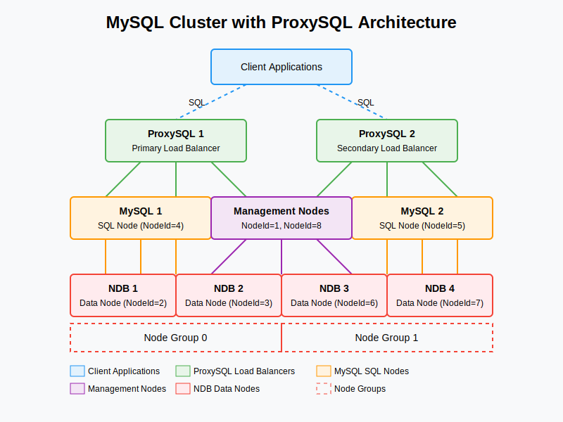

# MySQL Cluster with ProxySQL

A production-ready MySQL Cluster (NDB) setup with ProxySQL for high availability, load balancing, and read/write splitting. This project provides a complete solution for deploying a scalable and fault-tolerant MySQL database cluster using Docker Compose.

[](https://opensource.org/licenses/MIT)

## Features

- **High Availability**: No single point of failure with redundant components at every layer
- **Automatic Failover**: Seamless failover for management nodes, data nodes, SQL nodes, and load balancers
- **Read/Write Splitting**: Intelligent query routing based on query type (SELECT vs INSERT/UPDATE/DELETE)
- **Load Balancing**: Distributes queries across multiple MySQL nodes based on configured weights
- **Connection Pooling**: Efficient connection management through ProxySQL
- **Comprehensive Testing**: Automated test suite to verify all aspects of the cluster
- **User Management**: Centralized user management across all nodes

## Architecture



The setup includes:

- **Management Nodes (2)**: Primary and secondary management nodes for cluster coordination
- **Data Nodes (4)**: Organized in 2 node groups for redundancy
- **SQL Nodes (2)**: MySQL servers providing SQL interface to the cluster
- **ProxySQL Instances (2)**: Primary and secondary load balancers

## Quick Start

### Prerequisites

- Docker and Docker Compose
- At least 8GB RAM available for Docker
- Bash shell environment

### Deployment

```bash
# Clone the repository
git clone https://github.com/yourusername/mysql-cluster-proxysql.git
cd mysql-cluster-proxysql

# Start the entire stack
docker-compose up -d

# Verify the deployment
./mysql_cluster_test_suite.sh health
```

### Connecting to the Cluster

Connect through ProxySQL (recommended for production use):

```bash
# For read/write operations
mysql -h127.0.0.1 -P6033 -u${READWRITE_USER} -p${READWRITE_PASSWORD}

# For read-only operations
mysql -h127.0.0.1 -P6033 -u${READONLY_USER} -p${READONLY_PASSWORD}
```

## Documentation

Comprehensive documentation is available in the [docs](docs/index.md) directory:

- [Quick Start Guide](docs/getting-started/quick-start.md)
- [Architecture Overview](docs/architecture/overview.md)
- [Configuration Guide](docs/configuration/overview.md)
- [Operations Guide](docs/operations/management.md)
- [Testing Guide](docs/testing/overview.md)
- [Troubleshooting](docs/troubleshooting/common-issues.md)

## Contributing

Contributions are welcome! Please see our [Contributing Guide](CONTRIBUTING.md) for details.

## License

This project is licensed under the MIT License - see the [LICENSE](LICENSE) file for details.

## Testing

The project includes a comprehensive test suite to verify all aspects of the cluster:

```bash
# Run all tests
./mysql_cluster_test_suite.sh all

# Run specific test modules
./mysql_cluster_test_suite.sh health       # Test cluster health
./mysql_cluster_test_suite.sh proxysql     # Test ProxySQL configuration
./mysql_cluster_test_suite.sh data         # Test data operations
./mysql_cluster_test_suite.sh users        # Test user management
./mysql_cluster_test_suite.sh mysql-failover    # Test MySQL node failover
./mysql_cluster_test_suite.sh data-failover     # Test data node failover
./mysql_cluster_test_suite.sh proxysql-failover # Test ProxySQL failover
./mysql_cluster_test_suite.sh performance  # Test performance
```

## User Management

The project includes a user management script to handle users across all MySQL nodes and ProxySQL instances:

```bash
# Create a read-only user
./scripts/user_management.sh create readonly_user password123

# Create a read/write user
./scripts/user_management.sh -w create readwrite_user password123

# Create an admin user with all privileges
./scripts/user_management.sh -a create admin_user password123

# Delete a user
./scripts/user_management.sh delete user_to_delete

# List all users
./scripts/user_management.sh list
```

## Contributing

Contributions are welcome! Please feel free to submit a Pull Request.

## License

This project is licensed under the MIT License - see the [LICENSE](LICENSE) file for details.

## Testing High Throughput

A Python script is included to test the cluster with high throughput:

```bash
# Install the required Python package
pip install mysql-connector-python

# Run the test with default settings
python test-load.py

# Run with custom settings
python test-load.py --threads 20 --records 50000 --batch-size 5000
```

## Configuration Files

- `config/management-config.ini`: Configuration for the management node
- `config/data-config.ini`: Configuration for data nodes
- `config/my.cnf`: Configuration for MySQL SQL nodes
- `config/proxysql.cnf`: Configuration for ProxySQL
- `config/prometheus.yml`: Configuration for Prometheus
- `config/grafana/`: Configuration for Grafana

## Scaling for Production

This setup is designed to be a starting point for testing MySQL Cluster locally. For production use, you would need to:

1. Increase resources (CPU, RAM, disk) as specified in your BOQ
2. Use dedicated servers rather than containers
3. Configure proper network settings for high throughput
4. Implement proper backup strategies
5. Tune the configuration parameters based on your specific workload

## Checking Cluster Status

To check the status of the MySQL Cluster:

```bash
# Connect to the management node
docker exec -it management bash

# Check cluster status
ndb_mgm -e show

# You should see all nodes connected and started
```

## Troubleshooting

### Common Issues

1. **Insufficient Memory**: If containers crash, check Docker's memory limits
2. **Connection Issues**: Ensure all nodes can communicate with each other
3. **Data Node Failures**: Check logs for any configuration issues

### Viewing Logs

```bash
# View logs for a specific service
docker-compose logs [service_name]

# Follow logs in real-time
docker-compose logs -f [service_name]
```

## Production Readiness Checklist

Before deploying to production, ensure:

- [ ] All configuration parameters are tuned for your workload
- [ ] Memory settings match your server specifications
- [ ] Proper monitoring and alerting is set up
- [ ] Backup and recovery procedures are tested
- [ ] Network is configured for high throughput
- [ ] Security measures are implemented (passwords, network isolation, etc.)
